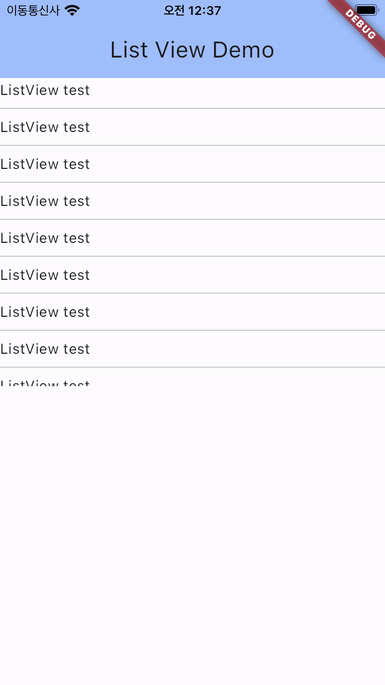
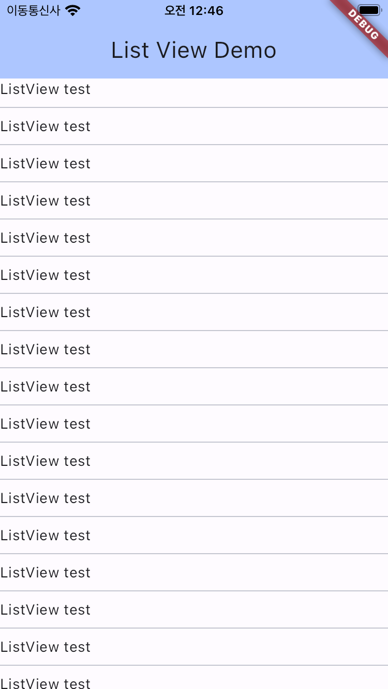

아래 에러는 flutter의 Column안에 ListView를 넣을 때 나오는 에러 입니다.<br>
제한된 수직공간(Column)에 무제한의 수직공간(ListView)이 들어가니 화면에 다 채울 수 없어 발생하는 에러입니다.
<br>
```
══╡ EXCEPTION CAUGHT BY RENDERING LIBRARY ╞═════════════════════════════════════════════════════════
The following assertion was thrown during performResize():
Vertical viewport was given unbounded height.
Viewports expand in the scrolling direction to fill their container. In this case, a vertical
viewport was given an unlimited amount of vertical space in which to expand. This situation
typically happens when a scrollable widget is nested inside another scrollable widget.
If this widget is always nested in a scrollable widget there is no need to use a viewport because
there will always be enough vertical space for the children. In this case, consider using a Column
or Wrap instead. Otherwise, consider using a CustomScrollView to concatenate arbitrary slivers into
a single scrollable.

The relevant error-causing widget was:
  ListView .......
```
<br>
아마도 아래와 같은 코드로 작성되었을 것입니다.
<br>

```
Column(children: [
  ListView.separated(
    itemCount: 100,
    itemBuilder: (BuildContext context, int index) {
      return const Text('ListView test');
    },
    separatorBuilder: (BuildContext context, int index) {
      return const Divider();
    },
  ),
])
```


이 문제를 해결하기 위해서는 몇가지 방법을 사용할 수 있습니다.
<br>
- ListView에 높이 (SizedBox 이용)를 주어 제한된 수직공간을 만들어 줍니다.
- ListView의 스크롤을 전체화면으로 보내고 shrinkWrap을 합니다.
<br>
```
//ListView에 높이 (SizedBox 이용)를 주어 제한된 수직공간을 만들어 줍니다.

body: Column(children:[
  SizedBox(
    height: 300,
    child: ListView.separated(
      itemCount: 100,
      itemBuilder: (BuildContext context, int index) {
        return const Text('ListView test');
      },
      separatorBuilder: (BuildContext context, int index) {
        return const Divider();
      },
    ),
  ),
])
```
<br>

<br>

```
//- ListView의 스크롤을 전체화면으로 보내고 shrinkWrap을 합니다.
body : SingleChildScrollView(
  child: Column(children: [
    ListView.separated(
      physics: const NeverScrollableScrollPhysics(),
      shrinkWrap: true,
      itemCount: 100,
      itemBuilder: (BuildContext context, int index) {
        return const Text('ListView test');
      },
      separatorBuilder: (BuildContext context, int index) {
        return const Divider();
      },
    ),
  ]),
)
```
